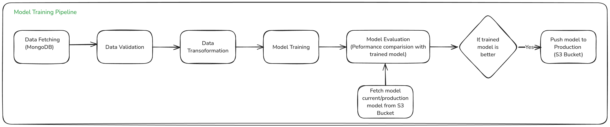
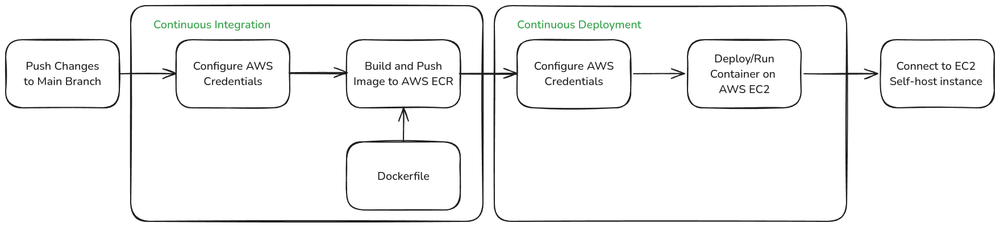
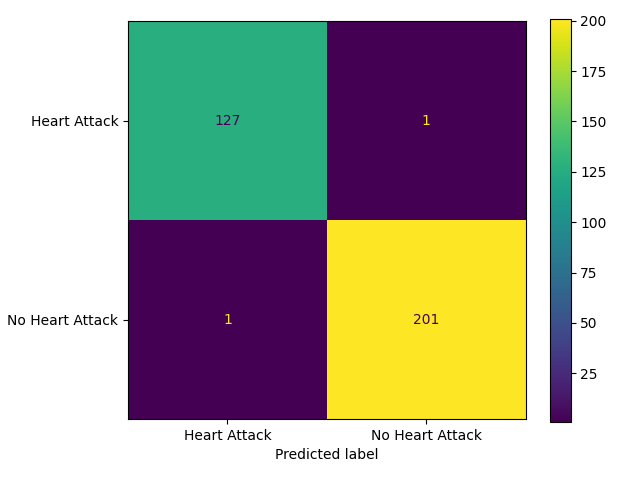

# Heart Attack Predictor - End-to-End MLOps Project


## About Dataset

### Context

The [heart attack datasets](https://www.kaggle.com/datasets/sukhmandeepsinghbrar/heart-attack-dataset/data) were collected at Zheen hospital in Erbil, Iraq, from January 2019 to May 2019. The attributes of this dataset are: age, gender, heart rate, systolic blood pressure, diastolic blood pressure, blood sugar, ck-mb and troponin with negative or positive output. According to the provided information, the medical dataset classifies either heart attack or none. The gender column in the data is normalized: the male is set to 1 and the female to 0. The glucose column is set to 1 if it is > 120; otherwise, 0. As for the output, positive is set to 1 and negative to 0.

### Dataset Glossary (Column-wise)

- **Age** - Age of the patient
- **Gender** - Gender of the patient (1-Male, 0-Female)
- **Heart Rate** - Heart rate of the patient
- **Blood Pressure** - Blood pressure of the patient (systolic and diastolic)
- **Blood Sugar** - Blood sugar levels of the patient
- **CK-MB** - Concentration of the CK-MB biomarker
- **Troponin** - Concentration of the Troponin biomarker
- **Result** - Diagnostic outcome for the patient (1-Heart Attack, 0-No Heart Attack)

## ✨ Key Features

- **End-to-End MLOps Pipeline:** Automates the ML lifecycle including Data Ingestion, Validation, Transformation, Model Training, Evaluation, and Deployment.
- **Modular Design:** Uses Python best practices (OOP) for maintainable components.
- **Hyperparameter Tuning & Experiment Tracking:** Leverages Optuna for optimization and MLflow for tracking experiments (See [Notebook](notebooks/02_model_exploration_training.ipynb)).
- **Classification Model:** Trains an XGBoost classifier (or similar) for heart attack prediction.
- **Database Integration:** Uses MongoDB Atlas for storing and retrieving data.
- **Cloud Integration:** Leverages AWS S3 for model storage and registry.
- **CI/CD Automation:** Implements Continuous Integration and Deployment using GitHub Actions, Docker, AWS ECR, and EC2.
- **Interactive Web Application:** Includes a Streamlit-based application (`app.py`) for making predictions.
- **Robustness:** Incorporates logging and exception handling.

## 🛠️ Technologies Used

- **Python:** Core programming language.
- **UV:** Environment management.
- **Jupyter Notebook:** For exploratory data analysis (EDA), model development, and training.
- **MongoDB Atlas:** Cloud database for data storage.
- **AWS:** `IAM`, `S3`, `ECR (Amazon Elastic Container Registry)`, `EC2` for cloud infrastructure, model storage, and deployment.
- **Streamlit:** For building the prediction API (`app.py`).
- **Docker:** Containerization for consistent environment.
- **GitHub Actions:** CI/CD automation.
- **Scikit-learn:** For data preparation.
- **XGBoost (XGBClassifier):** for training the model

## Project Structure

```tree
.
├── app.py
├── config
│   ├── model.yaml
│   └── schema.yaml
├── demo.py
├── Dockerfile
├── LICENSE
├── main.py
├── notebooks
│   ├── 00_mongo_db_setup.ipynb
│   ├── 01_exploratory_data_analysis.ipynb
│   └── 02_model_exploration_training.ipynb
├── pyproject.toml
├── readme_assets
├── README.md
├── requirements.txt
├── ruff.toml
├── scripts
│   └── video-to-giff.sh
├── setup.py
├── src
│   ├── cloud_storage
│   │   ├── aws_storage.py
│   │   └── __init__.py
│   ├── components
│   │   ├── data_ingestion.py
│   │   ├── data_transformation.py
│   │   ├── data_validation.py
│   │   ├── __init__.py
│   │   ├── model_evaluation.py
│   │   ├── model_pusher.py
│   │   └── model_trainer.py
│   ├── configuration
│   │   ├── aws_connection.py
│   │   ├── __init__.py
│   │   └── mongo_db_connection.py
│   ├── constants
│   │   └── __init__.py
│   ├── data_access
│   │   ├── __init__.py
│   │   └── proj1_data.py
│   ├── entity
│   │   ├── api_model.py
│   │   ├── artifact_entity.py
│   │   ├── config_entity.py
│   │   ├── estimator.py
│   │   ├── __init__.py
│   │   └── s3_estimator.py
│   ├── exception
│   │   └── __init__.py
│   ├── __init__.py
│   ├── logger
│   │   └── __init__.py
│   ├── pipline
│   │   ├── __init__.py
│   │   ├── prediction_pipeline.py
│   │   └── training_pipeline.py
│   └── utils
│       ├── __init__.py
│       ├── main_utils.py
│       └── visualization.py
└── uv.lock
```

### Model Training Pipeline



### CI/CD Pipeline



## 🔧 Setup & Installation

1. **Clone the repository:**

   ```bash
   git clone https://github.com/vivekpatel99/heart-attack-predictor-end-to-end-ml-project.git
   cd heart-attack-predictor-end-to-end-ml-project
   ```

   *(Note: The project structure is assumed to be pre-generated, potentially using a `template.py` script as mentioned in development steps.)*

2. **Create and Activate Virtual Environment (using `uv`)/Setup Project Environment:**

   *First, ensure you have `uv` installed. If not, follow the instructions here.*

   ```bash
   # uv will create a virtual environment named .venv and install dependencies
   uv sync
   ```

3. **Set up MongoDB Atlas:**

   - Sign up/log in to MongoDB Atlas.
   - Create a new project.
   - Create a free tier (M0) cluster.
   - Configure a database user (username/password).
   - Go to "Network Access" and add `0.0.0.0/0` to allow connections from any IP (for development; restrict in production).
   - Go to your cluster > "Connect" > "Drivers" > Select Python (3.6 or later).
   - Copy the connection string.

4. **Set up AWS:**

   - Log in to your AWS Console.
   - **IAM User:**
     - Go to IAM > Users > Create user (e.g., `heartattack-dev-user`).
     - Attach policies: `AdministratorAccess` (for ease of setup, consider more restrictive policies for production).
     - Create access key (select "Command Line Interface (CLI)") and download/copy the `AWS_ACCESS_KEY_ID` and `AWS_SECRET_ACCESS_KEY`.
   - **S3 Bucket:**
     - Go to S3 > Create bucket.
     - Choose a unique bucket name (e.g., `yourname-heartattack-models`).
     - Select the region (e.g., `us-east-1`).
     - Uncheck "Block all public access" and acknowledge (needed for simple deployment setup; review security implications).
     - Create the bucket.

5. **Set up Environment Variables:**

   - **Method 1: `.env` file (Recommended for Local Development)**

     - Create a `.env` file in the project root.
     - Add your credentials and configurations:

     ```dotenv
     # .env
     MONGODB_URL="mongodb+srv://<username>:<password>@<your-cluster-url>/?retryWrites=true&w=majority"
     AWS_ACCESS_KEY_ID="YOUR_AWS_ACCESS_KEY_ID"
     AWS_SECRET_ACCESS_KEY="YOUR_AWS_SECRET_ACCESS_KEY"
     AWS_REGION="us-east-1" # Or your chosen region
     # Add other necessary variables like DB_NAME, COLLECTION_NAME, BUCKET_NAME if needed by the code
     # BUCKET_NAME="yourname-heartattack-models"
     ```

     - *Note: Ensure `.env` is listed in your `.gitignore` file. If you are using `uv run`, `uv` will automatically load variables from a `.env` file in the current or parent directories, so manual exporting might not be necessary when running scripts via `uv run`.*
     - The application code needs to be configured to load variables from `.env` (e.g., using `python-dotenv`).

   - **Method 2: Exporting Variables (Common for Terminals/CI/CD)**

     - **Bash/Zsh:**

     ```bash
     export MONGODB_URL="mongodb+srv://<username>:<password>@..."
     export AWS_ACCESS_KEY_ID="YOUR_AWS_ACCESS_KEY_ID"
     export AWS_SECRET_ACCESS_KEY="YOUR_AWS_SECRET_ACCESS_KEY"
     export AWS_REGION="us-east-1"
     # Check: echo $MONGODB_URL
     ```

     - **PowerShell:**

     ```powershell
     $env:MONGODB_URL = "mongodb+srv://<username>:<password>@..."
     $env:AWS_ACCESS_KEY_ID = "YOUR_AWS_ACCESS_KEY_ID"
     $env:AWS_SECRET_ACCESS_KEY = "YOUR_AWS_SECRET_ACCESS_KEY"
     $env:AWS_REGION = "us-east-1"
     # Check: echo $env:MONGODB_URL
     ```

     - **Windows CMD (or System Environment Variables GUI):**

     ```cmd
     set MONGODB_URL="mongodb+srv://<username>:<password>@..."
     set AWS_ACCESS_KEY_ID="YOUR_AWS_ACCESS_KEY_ID"
     # ... etc
     ```

6. **Run the Project**

   ```bash
   uv run streamlit run app.py
   ```

7. **Push new changes to AWS**

   - First uncomment code from [Github Actions](.github/workflows/aws.yaml) for AWS.
   - the commit and push your changes. Github Action will automatically build and deploy project on `EC2` instance.

## 💾 Data Handling

- **Dataset Loading:** The initial dataset (from Kaggle) should be placed appropriately (e.g., in a `data/` or `notebooks/` directory).
- **MongoDB Upload:** Use the provided Jupyter notebook (e.g., `notebooks/mongoDB_demo.ipynb`) to upload the dataset to your configured MongoDB Atlas database.
- **Data Ingestion:** The pipeline's `DataIngestion` component reads data from MongoDB.

## 🏋️ Running the Training Pipeline

- Ensure your environment variables are set correctly (MongoDB URL, AWS Keys).
- Execute the main training pipeline script (e.g., `python main.py` or `python demo.py` - adjust command based on your project's entry point).
- This script orchestrates the following components:
  1. **Data Ingestion:** Fetches data from MongoDB.
  2. **Data Validation:** Checks data against a predefined schema (`config/schema.yaml`).
  3. **Data Transformation:** Performs preprocessing and feature engineering.
  4. **Model Training:** Trains the machine learning model.
  5. **Model Evaluation:** Evaluates the trained model against metrics and potentially a baseline model from S3.
  6. **Model Pusher:** If the model meets evaluation criteria, pushes the model artifacts (model file, preprocessor) to the configured AWS S3 bucket.

## 📈 Results & Visualizations




## 🖥️ Hardware Specifications

NOTE: To enhance ball detection accuracy, the YOLOv12L model was trained using an image size of 1280x1280. Training was performed using Lightning Studio to ensure sufficient GPU memory was available. The project was developed and tested on the following hardware:
it was developed and tested on the following hardware:

- **CPU:** AMD Ryzen 5900X
- **GPU:** NVIDIA GeForce RTX 3080 (10GB VRAM)
- **RAM:** 32 GB DDR4

While these specifications are recommended for optimal performance, the project can be adapted to run on systems with less powerful hardware.

## 📚 Reference

1. [Vehicle Insurance Data Pipeline](https://github.com/vikashishere/YT-MLops-Proj1/tree/main)
2. [Streamlit Tutorial](https://www.youtube.com/watch?v=yKTEC1Y5bEQ&t=1460s)
3. [Pydantic Tutorial](https://www.youtube.com/watch?v=rE-y-yMIeok&t=3649s)
4. [Optuna Tutorial](https://www.youtube.com/watch?v=E2b3SKMw934&t=683s)
